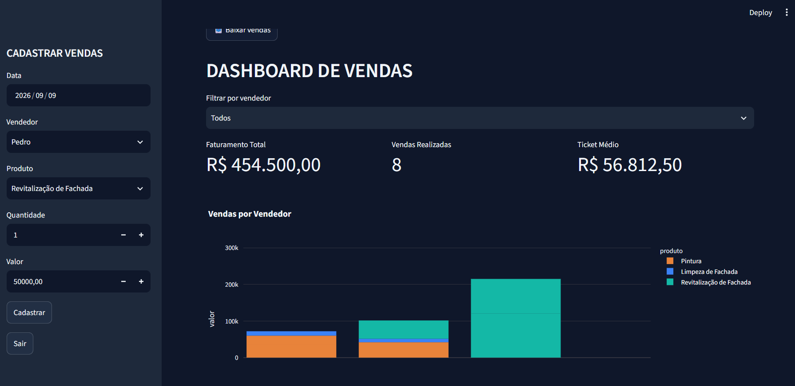

# 📐 Prumo | Gestão de Vendas

Sistema web de cadastro e gestão de vendas para empresas de serviços de fachada, com login, dashboard de indicadores e gráficos interativos.

🔗 **[Testar o sistema online](https://prumo-gestao-vendas.streamlit.app/)** · Usuário: `ADM` · Senha: `123`



## 💡 Sobre o projeto

O Prumo nasceu a partir do sistema de vendas desenvolvido no **Intensivão de Python** da [Hashtag Treinamentos](https://www.hashtagtreinamentos.com/). A partir dessa base, estudei por conta própria e transformei o exercício em um sistema completo, pensado para uma necessidade real: empresas de serviços de fachada que precisam registrar as vendas e acompanhar o desempenho da equipe comercial.

O nome vem do prumo, instrumento da construção civil usado para garantir que uma parede fique alinhada. Assim como ele, o sistema ajuda a manter as vendas sob controle.

## ✨ Funcionalidades

- **Login de acesso:** apenas usuários autorizados entram no sistema
- **Cadastro de vendas:** formulário na barra lateral com data, vendedor, produto, quantidade e valor unitário
- **Vendas cadastradas:** tabela com todo o histórico de vendas
- **Indicadores:** faturamento total, número de vendas realizadas e ticket médio, com valores no padrão brasileiro
- **Filtro por vendedor:** indicadores e gráficos se atualizam conforme o vendedor escolhido
- **Gráficos interativos:** vendas por vendedor (barras) e vendas por produto (pizza)

## 🚀 Base do curso × O que eu desenvolvi

**Base do Intensivão:** formulário de cadastro na barra lateral, gravação e leitura das vendas em arquivo e a lógica principal do sistema.

**O que eu desenvolvi estudando por conta própria:**

- Sistema de login com usuário e senha armazenados fora do código
- Identidade visual própria: nome, ícone e tema de cores
- Validação dos campos do formulário
- Cálculo do faturamento real (quantidade × valor unitário)
- Indicadores de faturamento, vendas realizadas e ticket médio, formatados em reais
- Filtro por vendedor no dashboard
- Gráficos com títulos e cores personalizadas
- Base de exemplo com dados realistas do setor
- Código organizado em seções comentadas

## 🔒 Segurança

As credenciais de acesso ficam no arquivo `secrets.toml` do Streamlit, que não faz parte do repositório. A comparação de senhas utiliza a função `hmac.compare_digest`, que evita ataques baseados no tempo de resposta.

## ⚠️ Observação sobre a versão online

Na versão publicada, as vendas cadastradas ficam em um armazenamento temporário e podem ser apagadas quando o servidor reinicia. Para uso real, o próximo passo é migrar os dados para um banco de dados.

## 🗺️ Próximos passos

- Módulo de bonificação de vendedores com base nas vendas fechadas
- Armazenamento permanente em banco de dados
- Separação dos dados por usuário

## 🛠️ Tecnologias

- **Python**
- **Streamlit:** interface web
- **Pandas:** manipulação dos dados
- **Plotly:** gráficos interativos

## ▶️ Como executar

1. Instale as dependências:

```
pip install -r requirements.txt
```

2. Na pasta do projeto, crie a pasta `.streamlit` e, dentro dela, o arquivo `secrets.toml` com os usuários:

```
[usuarios]
ADM = "123"
```

3. Execute o sistema:

```
streamlit run sistema_vendas.py
```

## 👩‍💻 Autora

**Maria Eduarda Tucunduva**

[LinkedIn](https://www.linkedin.com/in/maria-eduarda-tucunduva) · [GitHub](https://github.com/madutucunduva)
